## **Capítulo IV: Product Design
## 4.1. Style Guidelines

Un "style guideline" o guía de estilo es un conjunto de reglas y pautas que establecen la forma en que se deben escribir, diseñar o presentar documentos, contenido web, software, o cualquier otro tipo de trabajo creativo. A continuación, se otorga especificación a los parámetros implementados en la estructura del proyecto.

### 4.1.1. General Style Guidelines

El color elegido es el #E55E35, que es un color variado del naranja. Con este color se busca dar confianza, creatividad y por ser un color de “éxito”. Luego tenemos al color gris #494847 por ser clásico y de calidad, y de fondo el color crema #F4F0DF.

- #E55E35
- #494847
- #F4F0DF

El tipo de letra primaria es “Montserrat”. Esta la hemos escogido para el título, texto y los temas párrafos de la Landing Page.

Para el resto de los textos que se encuentren en la aplicación se utilizará el tipo de fuente “Didot”.

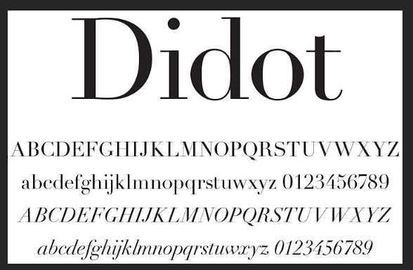

### 4.1.2. Web Style Guidelines

El color elegido es el #E55E35, que es un color variado del naranja. Con este color se busca dar confianza, creatividad y por ser un color de “éxito”. Luego tenemos al color gris #494847 por ser clásico y de calidad, y de fondo el color crema #F4F0DF.

- #E55E35
- #494847
- #F4F0DF

El tipo de letra primaria es “Montserrat”. Esta la hemos escogido para el título, texto y los temas párrafos de la Landing Page.

## 4.2. Information Architecture

Esta sección se centra en cómo está organizado y presentado el contenido tanto en la aplicación web como en la landing page. Aquí se detallan los aspectos clave como los sistemas de organización, etiquetado, búsqueda y navegación, que son evaluados para determinar cómo se distribuye y estructura la información dentro de la plataforma.

### 4.2.1. Organization Systems

A continuación, estarán los tipos de estructura visual que tendría cada segmento: 

- Landing Page

- Web Application

#### Organización visual

Esta nos permite poder implementarla en la pantalla de inicio del usuario que desea administrar su inventario. Debido a la jerarquía,

### 4.2.2. Labeling Systems

El sistema de etiquetado de nuestra aplicación tendrá un uso muy simple y fácil de entender para que los usuarios de la aplicación puedan usarlo e identificar las opciones de manera rápida y sin problema alguno.

Para la barra de navegación se tiene en mente lo siguiente:

- **Inicio:** Esta sección muestra el contenido adaptado específicamente para cada tipo de usuario y es lo primero que ven una vez se hayan autenticado en la aplicación web.
- **Perfil:** Esta sección contiene todos los detalles relacionados con la información personal del usuario, incluyendo datos como nombre, dirección, preferencias, entre otros.
- **Inventario:** Aquí se encuentran todos los detalles relacionados con el inventario del restaurante, incluyendo productos, cantidades, proveedores, precios y cualquier otra información relevante para la gestión eficiente de los recursos.
- **Ajustes:** Aquí los usuarios pueden configurar diversas opciones y preferencias relacionadas con el funcionamiento y la apariencia de la aplicación, como notificaciones, idioma, seguridad, entre otros aspectos.

### 4.2.3. SEO Tags and Meta Tags

En esta sección, los usuarios pueden personalizar distintas configuraciones y ajustes que influyen tanto en cómo opera la aplicación como en su apariencia. Esto abarca aspectos como el manejo de notificaciones, la selección de idioma, medidas de seguridad, y otros aspectos relevantes.

| Meta Data ID | Explicación                            | Ejemplo                              |
|--------------|----------------------------------------|--------------------------------------|
| Title        | Define el título del documento        | `<title>Ejemplo<title/>`            |
| Author       | Indica el autor del documento         | `<meta name=”author” content=”Nombre del autor”>` |
| Keywords     | Especifica una lista de palabras claves relevantes para el contenido del documento | `<meta name=”keywords” content=”palabra1, palabra2, palabra3”>` |
| Content Type | Especifica el tipo de contenido y la codificación de caracteres utilizada en el documento | `<meta http-equiv=”Content-Type” content=”text/html; charset=utf-8">` |
| Description  | Sirve para que se pueda encontrar más rápido la página en el navegador. | `<meta name=”description” content=”Una breve descripcion del contenido”>` |

### 4.2.4. Searching Systems

Para esta parte, en la aplicación hemos decidido colocar dos tipos de sistemas de búsquedas: una barra de búsqueda y otra de filtros.

La barra de búsqueda podrá ayudar al usuario a encontrar en el inventario un producto específico, con un código único o el nombre del producto.

El sistema de búsqueda por filtro podrá ayudar al usuario a encontrar un grupo específico de productos de manera rápida y fácil.

### 4.2.5. Navigation Systems

Para garantizar que los usuarios tengan una experiencia fluida y comprensible, se ha diseñado una estructura de información clara y coherente. Esto implica que el sitio cuenta con una navegación estática, lo que significa que los usuarios siempre tendrán acceso a una guía constante que les permita moverse por el sitio de manera intuitiva.

Esta guía de navegación les proporciona la seguridad de que siempre podrán retroceder o avanzar según sea necesario, facilitando así su interacción con el sitio.

### 4.3. Landing Page UI Design.
#### 4.3.1. Landing Page Wireframe.
**Header:** Acá se muestra el header, en donde decidimos mantenerlo simple y conciso. A la izquierda se encuentra nuestro logo, después los botones principales de la página como Plans y About Us, y al final a la derecha los botones de Login y Sign Up.\
\
**Presentation:** Acá se puede ver la presentación de nuestra página. Toda la información que se necesita mostrar al inicio estará en esta parte, además de imágenes y datos relevantes.\
\
**ChefStock:** Acá se puede ver el encabezado ”ChefStock” de la página. Tiene la misma idea que la pagina Presentation, en donde tiene que mostrar imágenes y datos relevantes para el usuario, además de texto hablando sobre la aplicación.\ 
\
**Plans:** Acá se pueden ver los 3 planes que ofrecemos a los usuarios, junto a los beneficios de cada uno y sus costos.\ 
\
**About Us:** Acá se puede apreciar la presentación de los integrantes del equipo, cada uno con su foto personal y su nombre completo.\ 
\
**Footer:** Acá se puede ver el footer con sus respectivos botones, similares a los del header, como Presentation, Plans, y otros datos relevantes para la página.\ 

#### 4.3.2. Landing Page Mock-up.
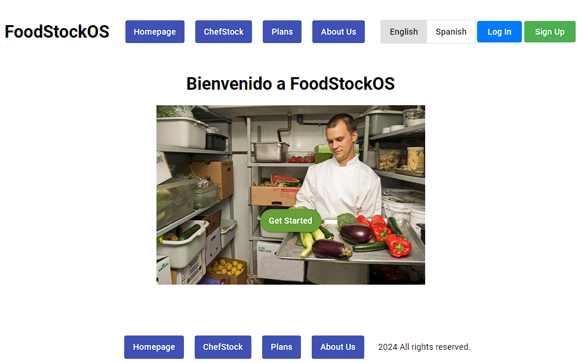

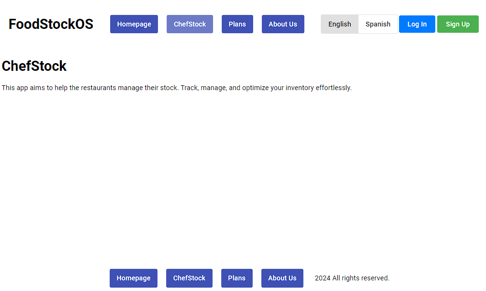

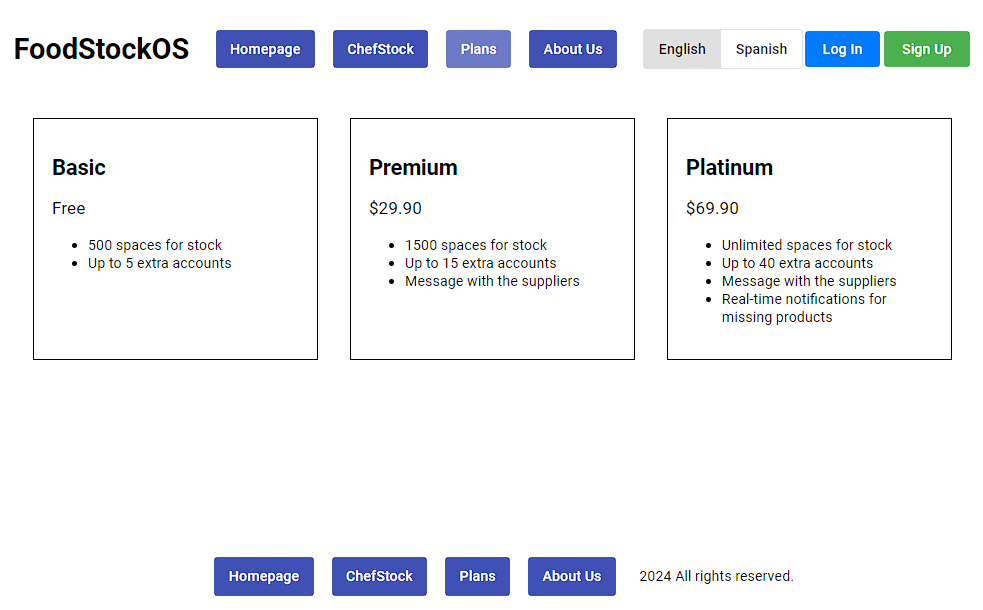

___
### 4.4. Web Applications UX/UI Design.
El desarrollo de la experiencia de usuario (UX) y la interfaz de usuario (UI) para aplicaciones web se enfoca en crear un entorno digital que sea natural y agradable de usar. La UX se ocupa de la comprensión profunda de las necesidades y comportamientos del usuario, estructurando los procesos y la organización del contenido de manera que resulte fácil interactuar con la aplicación. En contraste, la UI se encarga de los componentes visuales de la aplicación, tales como la selección y disposición de iconos, botones y textos. Un diseño UX/UI exitoso logra una fusión armónica de belleza visual y practicidad, proporcionando una experiencia de usuario atractiva y recordable.

#### 4.4.1. Web Applications Wireframes.

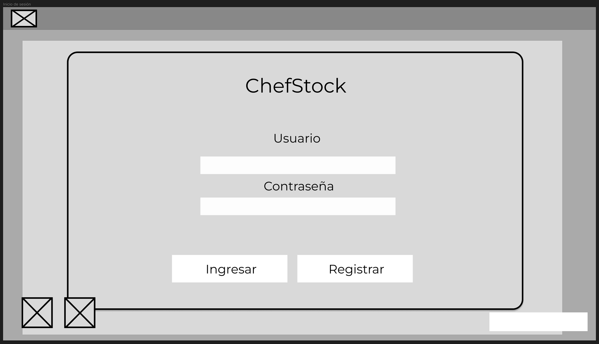

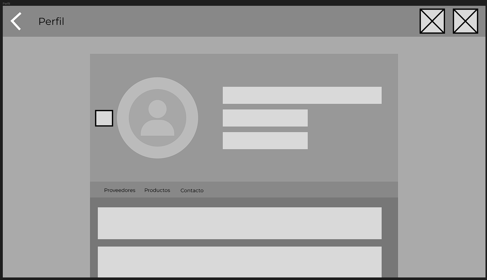

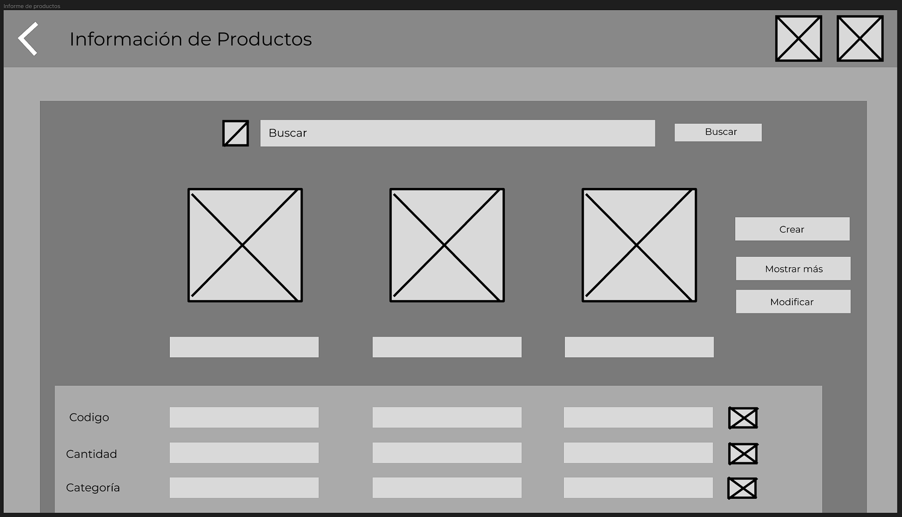

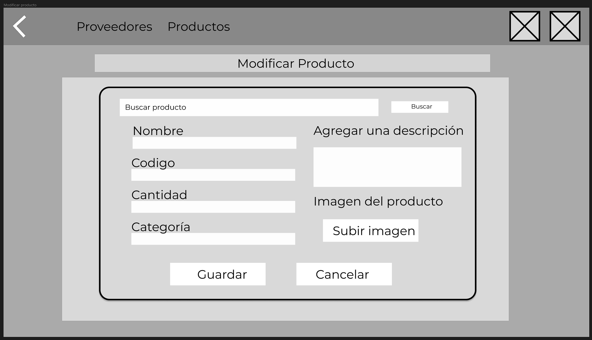

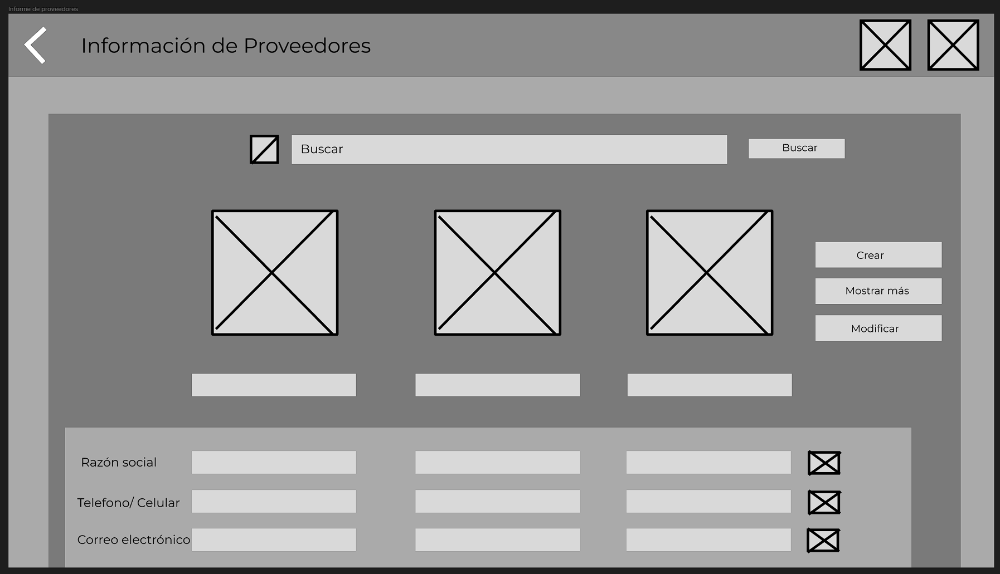

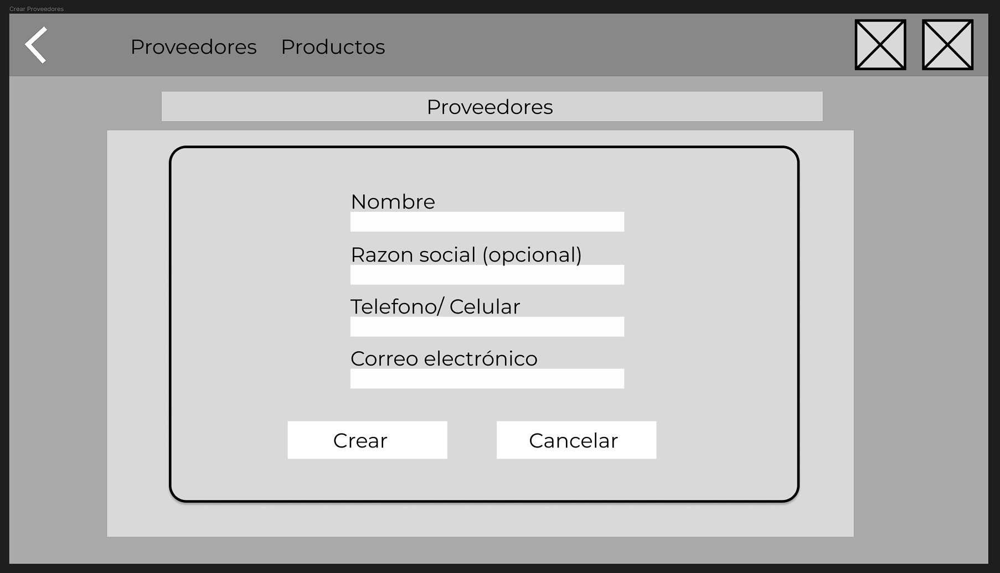

#### 4.4.2. Web Applications Wireflow Diagrams.
Al abrir la aplicación, se presenta inicialmente la pantalla de 'iniciar sesión'. En esta pantalla, los usuarios pueden ingresar utilizando su nombre de usuario y contraseña. Si el usuario no posee una cuenta, puede seleccionar la opción 'registrar' para crear una nueva. Durante el proceso de registro, no se requiere la compra previa de un dispositivo para crear la cuenta, ya que la cuenta no está ligada directamente a un dispositivo. Cuando el usuario inicie sesión o se registra con éxito, accederá al menú principal de la aplicación, donde podrá navegar mediante funciones como gestión de proveedores y productos.

#### 4.4.3. Web Applications Mock-ups.

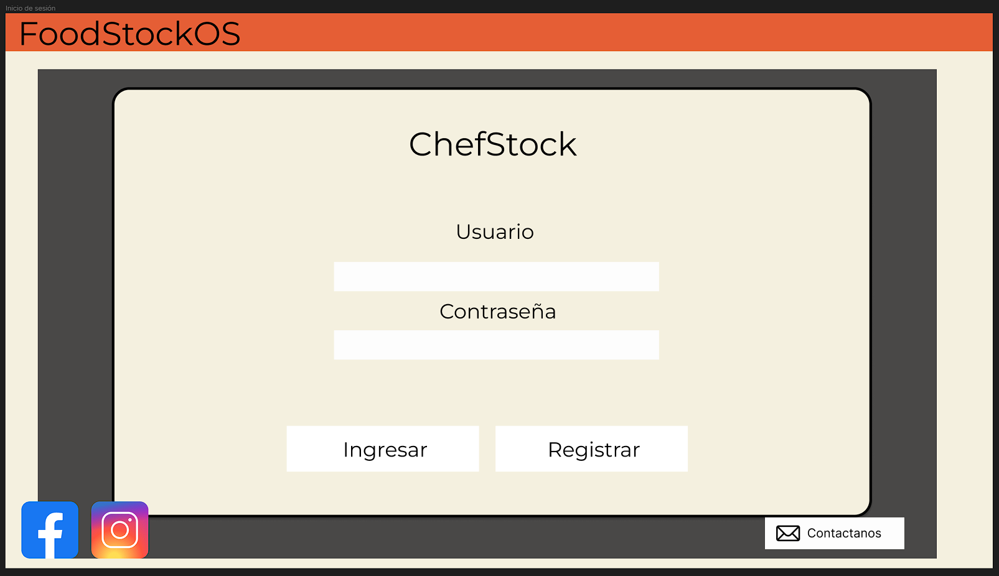

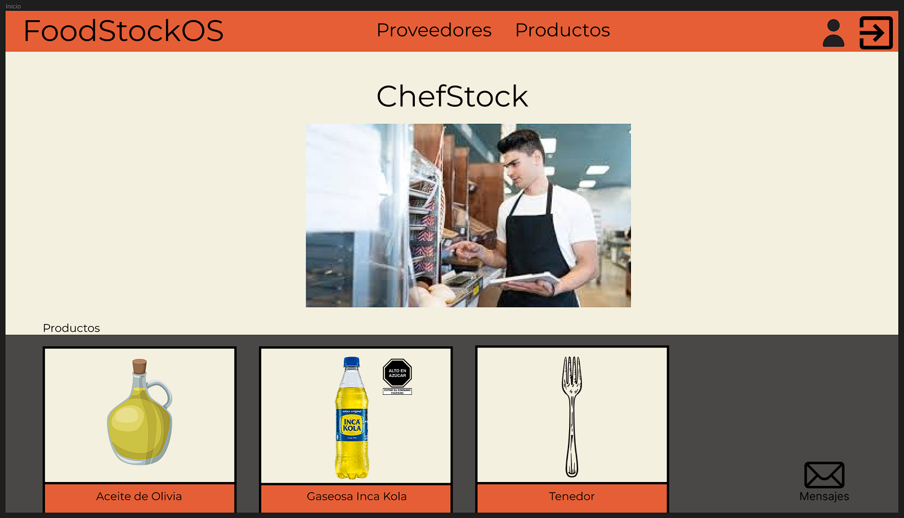

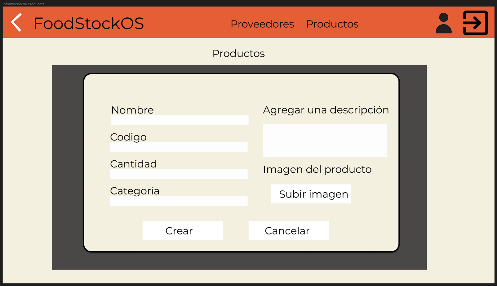

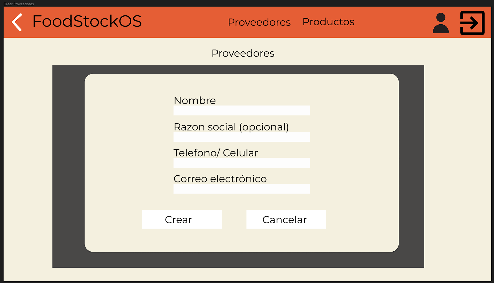

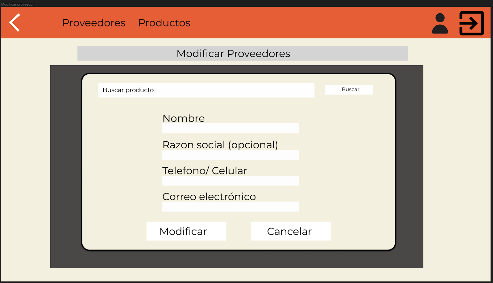

Link a nuestra herramienta de trabajo (Figma): https://www.figma.com/proto/jMEFfuUGgA39OBzRyQS87O/Web-Applications-Mock-ups?type=design&node-id=1-2&t=bhfHoLW7QX0Ohvg7-1&scaling=contain&page-id=0%3A1&starting-point-node-id=1%3A2&mode=design

#### 4.4.4. Web Applications User Flow Diagrams.

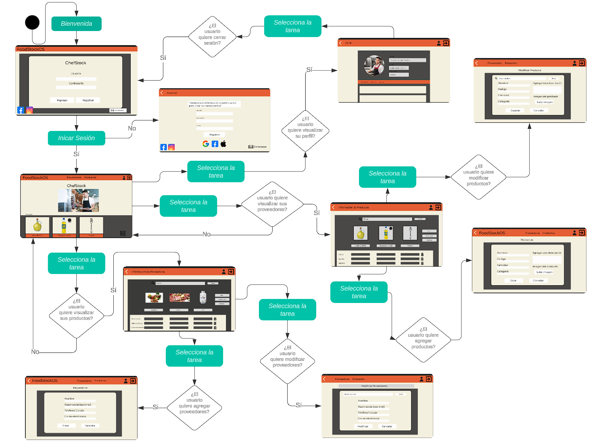

Link a nuestra herramieta de trabajo (Lucidchart):
https://lucid.app/lucidchart/6a92778d-80c8-4f88-b377-a04c43c7cf3a/edit?viewport_loc=-267%2C-5%2C2599%2C1316%2C0_0&invitationId=inv_570aae27-52dc-4188-bff7-b180f62956e2

---
### 4.5. Web Applications Prototyping.

Link a nuestra herramienta de trabajo (Figma): https://www.figma.com/proto/jMEFfuUGgA39OBzRyQS87O/Web-Applications-Mock-ups?type=design&node-id=1-2&t=bhfHoLW7QX0Ohvg7-1&scaling=contain&page-id=0%3A1&starting-point-node-id=1%3A2&mode=design

### 4.6. Domain-Driven Software Architecture.

La implementación de la arquitectura orientada al dominio (DDD) es crucial para nuestro proyecto. Esta estrategia de desarrollo nos facilitará la creación de sistemas de software que representen con precisión y eficacia el área del problema que estamos tratando. Empleando los conceptos de DDD, estaremos en condiciones de reconocer y esquematizar adecuadamente las entidades, agregaciones y contextos específicos del dominio. Esto nos posibilitará desarrollar una estructura de software que se caracterice por su flexibilidad, capacidad de ampliación y sencillez en su mantenimiento.

### 4.6.1. Software Architecture Context Diagram

### 4.6.2. Software Architecture Container Diagrams

### 4.6.3. Software Architecture Components Diagrams

## 4.7. Software Object-Oriented Design

### 4.7.1. Class Diagrams

### 4.7.2. Class Dictionary
**Trabajador:** Persona que trabaja en el restaurante y se encarga de diferentes actividades en el lugar. 

**Restaurante:** Entidad a donde los clientes van a realizar pedidos y se ubica el inventario. 

**Cliente:** Persona que va al restaurante a pedir comida y puede hacer comentarios al respecto. 

**Inventario:** Lugar en donde se almacena todos los productos que se utilizara en el restaurante. 

**Producto:** Entidad que se vende en los restaurantes y se guarda en el inventario por cierto periodo de tiempo.
## 4.8. Database Design
### 4.8.1. Database Diagram
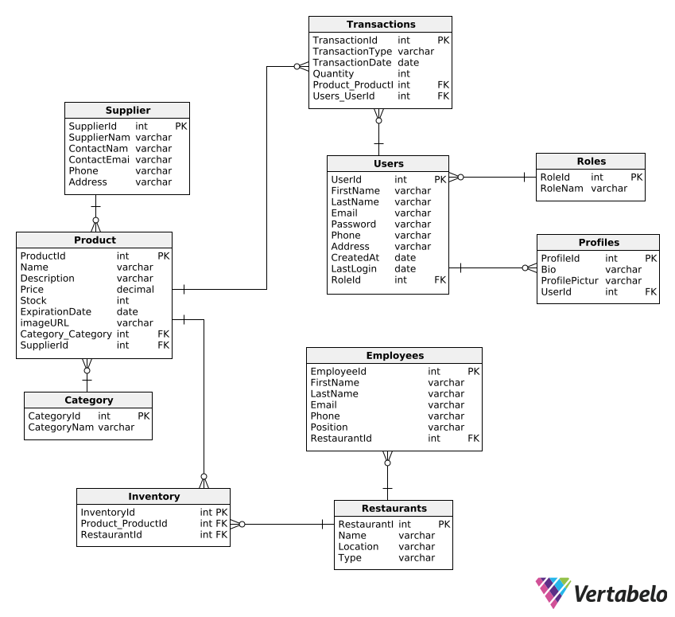

